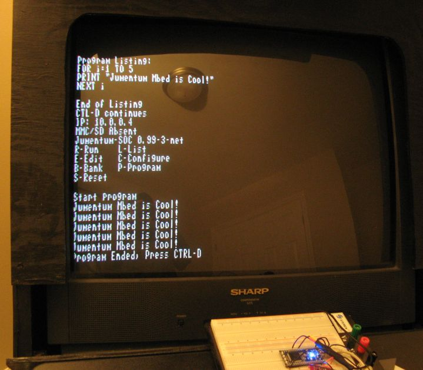

Jumentum-SOC composite video and PS/2 keyboard support 

# Jumentum-SOC composite video and PS/2 keyboard support

  
by Daniel L. Marks (profdc9 at gmail.com)

- - -

Jumentum-SOC as of version 0.99.3 (only for the LPC1768) is able to produce NTSC and PAL composite video for use on an analog television (also works with HD televisions with a composite input - usually a yellow jack). To use it, there is a schematic file included called **mbed-video-diagram.jpg**. This shows how to create a cable to hook up an [mbed](http://mbed.org/) or other LPC1768-based prototype board to your television and keyboard. Three resistors are required to create the needed divider network between the output and the composite video as shown. Both the mbed pins and the LPC1768 pins are given depending on which board you have.

The keyboard input is provided by an old style (but often readily available) PS/2 keyboard. This is also plugged into the microcontroller and a 5 volt power source. The resulting TV output is shown as seen in this photograph:

Connected this way, a LPC1768 can be used as a standalone microcontroller for BASIC programming without a host computer. All network functions remain available if needed.

- - -

Dan Marks, last updated _October 22, 2011_
