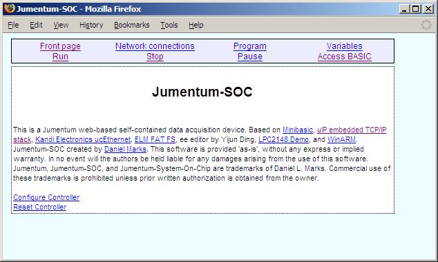
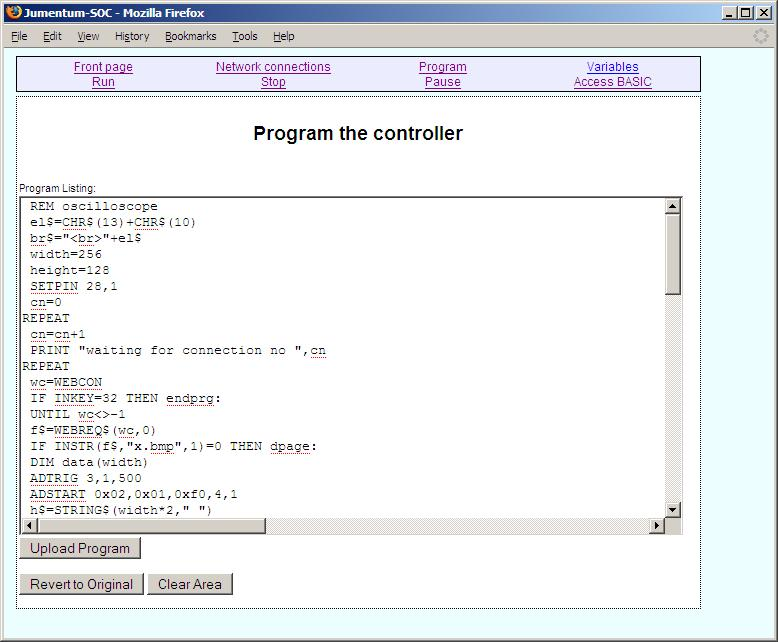
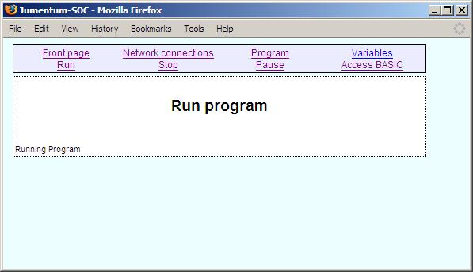
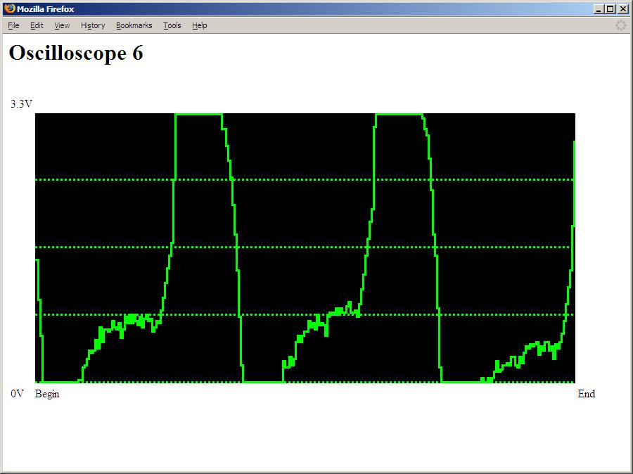
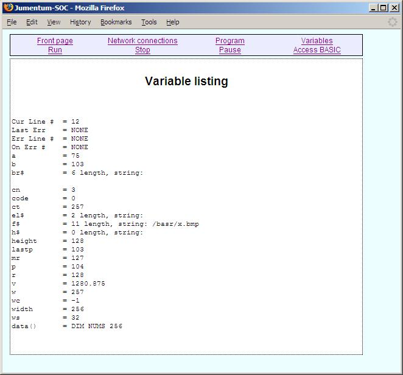
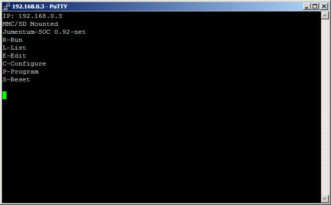
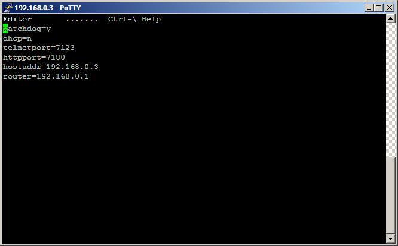
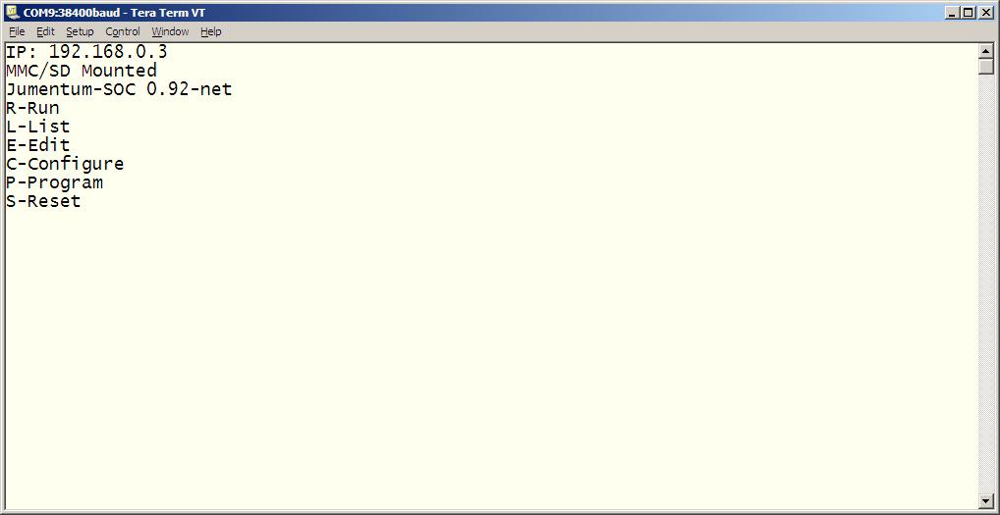

# Jumentum-SOC Screenshots

  
Front page of Jumentum-SOC

  
Programming window

  
Running a program

  
Accessing the web page output by the currently running program, in this case an oscilloscope-like application

  
Showing the variables of a currently running program

  
A text-based session accessed through a TELNET network terminal

  
The internal configuration edited through the built-in text editor

  
A text-based session accessed through the serial port

- - -

Jumentum-SOC comments to _profdc9 at gmail dot com_.
